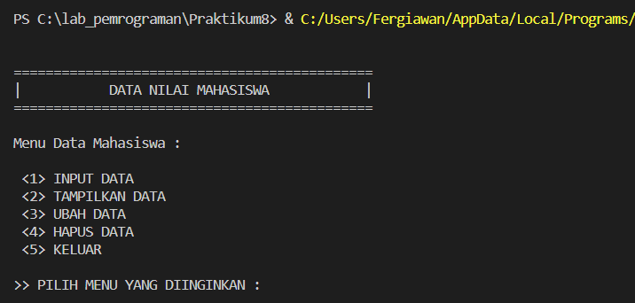
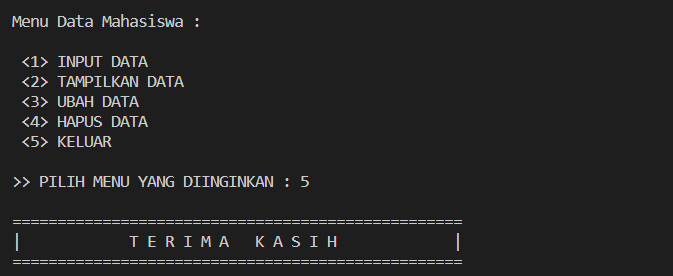
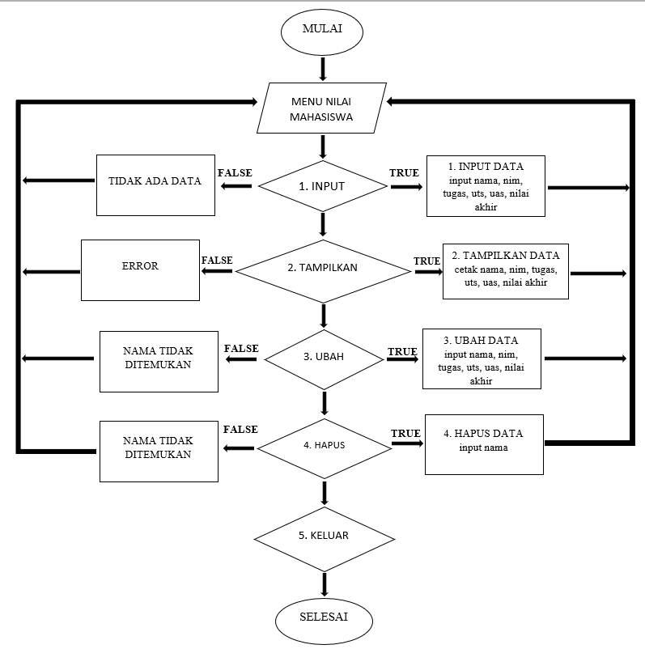

# Praktikum8
## Fergiawan Satrio Bagaskoro
### Latihan 1
Di praktikum kali ini kita akan membuat daftar nilai mahasiswa dengan penggunaan class beserta flowchartnya
Dibawah ini adalah contoh code program dengan penggunaan class
### Source Code
```
a = {}
class A():
     def __init__(self,nama,nim,tugas,uts,uas,akhir):
        while True:
            print("\n")
            print('='*45)
            print("| {0:^41} |".format("DATA NILAI MAHASISWA"))
            print('='*45)
            print()
            print('Menu Data Mahasiswa : \n')
            print(" <1> INPUT DATA")
            print(" <2> TAMPILKAN DATA")
            print(" <3> UBAH DATA")
            print(" <4> HAPUS DATA")
            print(" <5> KELUAR \n")

            c = input(">> PILIH MENU YANG DIINGINKAN : ")

            if c == '1':
                self.TAMBAH()
            elif c == '2':
                self.TAMPILKAN()
            elif c == '3':
                self.UBAH()
            elif c == '4':
                self.HAPUS()
            elif c == '5':
                self.KELUAR()
                break

     def TAMBAH(self):
        print()
        print("Tambah Data")
        self.nim    = input('Nama Mahasiswa          : ')
        self.nama   = input('NIM Mahasiswa           : ')
        self.tugas  = int(input('Masukkan Nilai Tugas\t: '))
        self.uts    = int(input('Masukkan Nilai UTS\t: '))
        self.uas    = int(input('Masukkan Nilai UAS\t: '))
        self.akhir = (self.tugas * 30/100) + (self.uts * 35/100) + (self.uas * 35/100)
        a[self.nim] = self.nama, self.tugas, self.uts, self.uas, self.akhir

class mahasiswa(A):

    def TAMPILKAN(self):
        print()
        if a.items():
            print('=' *85)
            print('|   NO  |    NAMA        |     NIM     |  TUGAS  |   UTS   |   UAS   |     AKHIR    |')
            print('=' *85)
            i = 0
            for b in a.items():
                i += 1
                print("|    {no:2d} | {0:14s} | {1:11s} | {2:7d} | {3:7d} | {4:7d} |    {5:6.2f}    |".format (b[0][: 14],b[1][0],b[1][1],b[1][2],b[1][3],b[1][4], no = i))
                print('=' *85)
        else:
            print('=' *85)
            print('|   NO  |    NAMA        |     NIM     |  TUGAS  |   UTS   |   UAS   |     AKHIR    |')
            print('=' *85)
            print("| {0:^81} |".format("TIDAK ADA DATA"))
            print('=' *85)
    
    def UBAH(self):
        print()
        print("Ubah Data")
        self.nama = input("Masukkan Nama   : ")
        if self.nama in a.keys():
            self.nim = input("Masukkan Nim\t: ")
            self.tugas = int(input("Nilai tugas\t: "))
            self.uts = int(input("Nilai UTS\t: "))
            self.uas = int(input("Nilai UAS\t: "))
            self.akhir = (self.tugas * 30/100) + (self.uts * 35/100) + (self.uas * 35/100)
            a[self.nama] = self.nim, self.tugas, self.uts, self.uas, self.akhir
        else:
            print("DATA {0} TIDAK DITEMUKAN" . format(self.nama))

    def HAPUS(self):
        print()
        print("Hapus Data")
        self.nama = input("masukkan Nama  : ")

        if self.nama in a.keys():
            del a[self.nama]
        else:
            print("DATA {0} TIDAK DITEMUKAN" . format(self.nama))

    def KELUAR(self):
        print()
        print('=' *50)
        print("| {0:^46} |".format("T E R I M A   K A S I H"))
        print('=' *50)
        print()
datamhs = mahasiswa("nama", "nim", "uts", "uas", "tugas", "akhir")
```

Dan Output dari code program diatas adalah seperti dibawah ini



Disini saya membuat beberapa pilihan menu untuk menambahkan data, menampilkan data, mengubah data, menghapus data, dan
Keluar untuk menghentikan program.
Dan kita akan mencoba memilih menu 1 untuk menambahkankan data mahasiswa


Setelah kita menambahkan data, kita juga bisa menampilkan data yang telah kita input dengan memilih menu 2


Dan jika kita tidak ingin merubah apapun terkait data yang telah kita input, kita akan memilih menu 5 untuk menghentikan program



### Flowchart



**DESKRIPSI**
1. Saat run program akan menampilkan beberapa menu pilihan
2. Pilih menu keberapa yang diinginkan
3. Jika memilih menu 1 maka output akan menampilkan data yang telah kita input dan jika kita belum menginput data
    maka tampilannya akan tertulis "TIDAK ADA DATA"
3. Jika memilih memilih menu 2 maka input data mahasiswa berupa nama, nim, tugas, uts, dan uas
4. Jika memilih menu 3 maka akan menginput nama dari data yang ingin di ubah, lalu masukan nim, tugas, uts,uas
5. Jika memilih menu 4 maka input nama dari data yang ingin kita di hapus
7. Jika memilih menu 5 maka program akan berhenti (BREAK)
8. Selesai